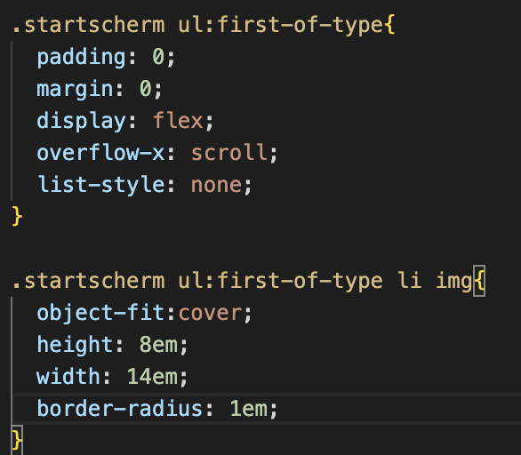
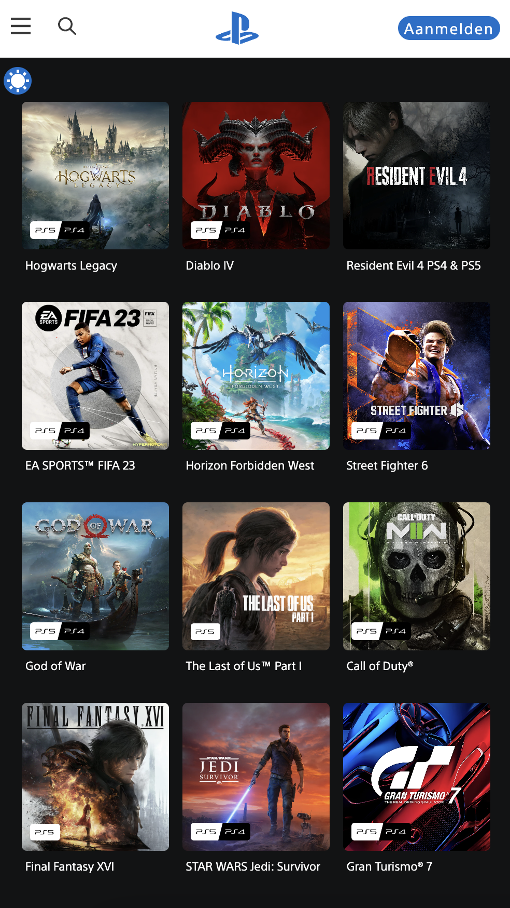

# Procesverslag

## Jij

  
uitwerken voor kick-off werkgroep

  ### Auteur:
  Tessa Heijnen

  #### Je startniveau:
  Blauwe piste 

  #### Je focus:
  Surface plane
 

## Je website

  
uitwerken voor kick-off werkgroep

  ### Je opdracht:
  Playstation website: https://www.playstation.com/nl-nl/

  #### Screenshot(s) van de eerste pagina (small screen): 
  Homepagina
  
 

## Toegankelijkheidstest 1/2 (week 1)

  
Uitwerken na test in 2e werkgroep

  ### Bevindingen
  
  
  
  
  
  Lijst met bevindingen die in de screenreader test naar voren kwamen:
  - Content laad te snel bij startscherm slider: waardoor de Voice over nog niet klaar is met praten en dus niet uit kan praten omdat de volgende afbeelding met alt tekst al weer tevoorschijn komt. 
  - Alle letters gaan ook los door de screenreader en niet de woorden in het geheel. Dus eerst los en dan pas als geheel.
  - Lijstje met alle voordelen worden 1 voor 1 opgesomd plus alle vinkjes die erachter staan. Dat is misschien overbodig.
  Lijst met bevindingen die in de WCAG checklist test naar voren kwamen:
  - Valide code: meerdere errors, en paar foutmeldingen: Kan geen resource laden of 404 foutcode zonder info
  - Elke pagina heeft dezelfde titel alleen net wat anders. Dit is niet echt overzichtelijk.   
  - Sommige knoppen staan te dicht op elkaar. Anderzijds heb je ook knoppen die voldoende ruimte hebben. 
  - Text alternatives: ja maar het kan nog uitgebreider: voorbeeld: alt="Montage of Final Fantasy artwork from a variety of games in the series"
  - Niet duidelijk genoeg, een deel van de tekst staat erop. Het belangrijkste. Overbodige info wordt weggelaten
  - Sommige onderdelen kunnen op pauze gezet worden: voorbeeld: videos met pauze knop. Maar niet automatische afgespeeld media zoals een carrousel. 
  - Zie meer bevindingen in de WCAG checklist

## Breakdownschets (week 1)

  
uitwerken na afloop 3e werkgroep

  ### de hele pagina: 
  

  ### dynamisch deel (bijv menu): 
  

## Voortgang 1 (week 2)

  
uitwerken voor 1e voortgang

  ### Stand van zaken
  - Dit ging goed: Door de breakdown schets had ik een duidelijk beeld hoe ik m'n html moest opbouwen. Dus dit ging goed
  - Dit was lastig: Allereerst ben ik begonnen met het maken van de slider, die je gelijk ziet als je de pagina laad. Ik wist niet goed hoe ik moest beginnen. Of hoe ik de li's zo kreeg dat van de 6 afbeelingen. De eerste 3 zichtbaar zijn op het scherm en de overige 3 erbuiten vallen. 

  ### Agenda voor meeting
  samen met je groepje opstellen

  - Bespreken: header en slider
  - Afmaken: de slider wil ik zo maken dat het qua positite goed staat en dat je er doorheen kunt scrollen
  - Als er nog tijd is: Als ik nog tijd heb wil ik er ook voor zorgen dat je oneindig door de slider heen kunt scrollen

  ### Verslag van meeting
 De uitkomsten van de meeting

  - Voor nu: de de header en slider even overslaan en doorgaan met de rest van de website. 
  - De slider zou ik kunnen maken dmv van data id's. 
  - Zorg ervoor dat elke section begint met een h2. 
  - Je kan met grid er dan voor zorgen dat de h2 bijvoorbeeld wel weer als 2de in de row/rij komt.

## Voortgang 2 (week 3)

  
uitwerken voor 2e voortgang

  ### Stand van zaken
 - Tijdens dit voortgangsgesprek was ik bezig met de .DezeMaand section. 
 - Wat hier goed aan ging was het positioneren van de h2, p, button en ul. Alles staat onder elkaar en de li bevat enkel een img en p tekst waardoor het makkelijk was om dit op de goed eplek te krijgen. 
  - Dit was lastig: Wat er lastig was aan dit onderdeel was de gradient. Dit heb ik uiteindelijk weten op te lossen met een div. Ik had al een vermoeden dat dit met een div gedaan moest worden maar dat stelde ik uit aangezien de quote luid: "Geen Divs". Ik had namelijk eerst van die div een section gemaakt maar die kon ik niet opvullen met een kleur aangezien er niks inzat. 

  ### Agenda voor meeting
 De uitkomsten van de meeting

  - Bespreken: Hoe ik de gradient kan krijgen onder de tekst
  - Afmaken: Gradient onder de tekst krijgen
  - Als er nog tijd is: vragen hoe je tekst binnen de container gecentreerd kan positioneren

  ### Verslag van meeting
  Hier na afloop snel de uitkomsten van de meeting vastleggen

  - Align-text: center. 
  - Gebruik een div en geef deze de linear gradient. Die twee kleur waardes heeft van kleur 1 naar transparant. Zodat het doorzichtig word. 

## Toegankelijkheidstest 2/2 (week 4)

  
uitwerken na test in 9e werkgroep

  ### Bevindingen
  
  
  
  
  

  Toen ik mijn website ging testen was heel veel nog niet klaar.
  Maar wat ik heb aangepast is: 
  - Dark-modus toegevoegd want dat heb de playstation website niet
  - De slider aan de bovenkant van de pagina speelt nu niet meer automatisch af. Dit is beter voor screenreader zodat de tekst niet halverwege onderbroken wordt 
  - Wat content gerelateerde elementen zoals het twitter en x logo: Wees consistent 
  - Onderaan de footer: zat er op de orginele website een overlapping in tekst omdat deze te lang was maar dat heb ik weggehaald door de tekst onder elkaar te plaatsen. 

  Zie overige bevindingen in de documentatie staan.

## Voortgang 3 (week 4)

  
uitwerken voor 3e voortgang

  ### Stand van zaken
  - Wat hier goed aan ging was dat ik het voor elkaar had gekregen om de slider alsnog te laten scrollen in een loop.
  - Dit was lastig: alle verschillende onderdelen in de li positioneren met grid.

  ### Agenda voor meeting
  De uitkomsten van de meeting

  - Bespreken: Alle verschillende onderdelen in de li positioneren met grid.
  - Afmaken: Alle verschillende onderdelen in de li positioneren met grid.
  - Als er nog tijd is: Nog meer grid gerealateerde vragen. Sommige sections moeten een grid hebben en wat is dan het beste om neer te zetten bij grid-template-row: 1fr of auto / 2em of ?

  ### Verslag van meeting
  hier na afloop snel de uitkomsten van de meeting vastleggen

  - gebruik max-content bij het instellen van het grid. Hierdoor neemt de row de hoogte aan van het element dat erin zit.
  - Ging minder goed: Alleen ik had ook na het gesprek dit toegepast maar ik had een div die een hogere waarde qua hoogte had als de p die bovenop de div stond waardoor de hoogte van de row de waarde van de div overnam ipv de tekst. Uiteindelijk ben ik erachter gekomen dat je de container dan een position:relative moet geven zodat je aan de div position: absolute kan geven zodat de tekst-hoogte wordt overgenomen door de row.

## Eindgesprek (week 5)

  
uitwerken voor eindgesprek

  ### Je uitkomst - karakteristiek screenshots:
  

  ### Dit ging goed/Heb ik geleerd: 
  - Ik heb geleerd hoe je met grid moet werken.
  - En dat je alle onderdelen die binnen het grid vallen wel moet benoemen anders nemen ze zelf een eigen plaats in. 
   
  
  - Ik heb geleerd hoe je animaties kan maken dmv keyframes
   
   <video autoplay loop muted> <source src="readme-images/animatie.mov" width="375px" type="video/mp4">
   
  - Ik heb geleerd hoe je :root kan gebruiken
  - En hoe je de :root kan gebruiken voor dark-modus
  
  
  - Ik heb geleerd hoe je een svg kan animeren
   <video autoplay loop muted> <source src="readme-images/instaAnimatie.mov.mov" width="375px" type="video/mp4">
  
  - Het Social media gedeelte ging goed want het was aan het einde van de website dus toen wist ik hoe grid werkte
  
  - Dit geldt hetzelfde voor de .Clothing section. Hierdoor ging het toepassen van het grid op de kleding groepen snel. 
  
  - Het maken van de .playstationStore section was makkelijk omdat er weinig onderdelen in de sectie zitten.
  

  

  ### Dit was lastig/Is niet gelukt:
  - Het maken van een carroussel waarbij je op de knoppen kunt klikken om naar het debtreffende plaatje te gaan. 
  De CSS had ik op orde alleen ik moest de actie nog voor elkaar krijgen. Ik weet inmiddels ongeveer hoe het moet alleen ik had geen tijd meer om dit uit te voeren. Het had gekund dmv van een id te koppelen aan de afbeeling en een data-id aan de bijhorende button. 
  
  

  - In het begin had ik wat moeite met grid maar nadat ik dit meerdere keren heb gedaan, werd het steeds makkelijker.
  - Oom heb ik lopen struggelen met de slider aan de bovenkant van mn pagina en de bijhorende grid. Dit kwam omdat het gewoon heel veel verschillende onderdelen waren die gepositioneerd moest worden. Dus het was heel veel code waardoor ik soms het overzicht kwijt raaktte. 

- bijna elk onderdeel was lastig, het lukt niet in 1x maar uitiendelijk lukt het wel.

  

## Bronnenlijst

  
continu bijhouden terwijl je werkt

  1. Darkmode root: https://www.youtube.com/watch?v=6YrOGKmGTCY
  2. Darkmode icon: https://www.youtube.com/watch?v=OnQjkkQhKQg*/
  3. Loading state: https://codepen.io/stphnnnn/pen/BPboyN?editors=1100 * delay, keyframes */
  4. Darkmode JS Bron: https://lukelowrey.com/css-variable-theme-switcher/
  5. Flexbox: https://css-tricks.com/snippets/css/a-guide-to-flexbox/
  6. Grid: https://css-tricks.com/snippets/css/complete-guide-grid/
  7. ChatOpenAi
  8. Flex opdracht uit de les voor de header
  9. Marten Moolenaar
  10. Evi Wammes

